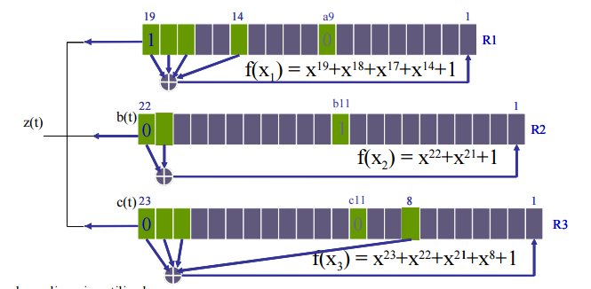

# Práctica para la asignatura de [_Seguridad en sistemas informáticos_](https://campusvirtual.ull.es/1516/course/view.php?id=143) en la que se pide:
---
### Objetivo: Implementar el cifrado A5/1.

Desarrollo:
Implementa el cifrado y descifrado A5/1 según el esquema que se incluye a continuación:

---

---
Del esquema anterior concluimos los siguientes polinomios para el algoritmo:
* LFSR1: p1(x) = x19 + x18 + x17 + x14 + 1, genera a(t)
* LFSR2: p2(x) = x22 + x21 + 1, genera b(t)
* LFSR2: p3(x) = x23 + x22 + x21 +x8 + 1, genera c(t)

En base a esto, se generará la secuencia cifrante bit a bit[a(t) XOR b(t) XOR c(t)] para, posteriormente, cifrar el texto indicado, que se hará con una operación de XOR entre el texto y la secuencia cifrante.

#### En la práctica se pidió realizar la siguiente modificación:
La modificación consiste en inicializar los registros a partir de la
semilla dada, en un bucle desde 0..63(ya que la suma de las semillas de cada registro 19+22+23=64, con lo que la semilla total tiene un tamaño de 64) realizamos el cálculo de cada bit de entrada de manera normal con
el añadido de que debemos incluir en el XOR el elemento de la clave
que tenga índice igual al número de iteración en la que estemos.
Teniendo en cuenta que los tres registros comienzan inicializados a 0.

#### Para ejecutar: _"ruby main.rb"_ o _"ruby main_modificacion.rb"_
Al ejecutar _"main.rb"_ se ejecutará el programa sin modificación.

### Enlaces:

+ [Página personal.](http://alu0100768893.github.io/)
+ [Repositorio de la práctica.](https://github.com/alu0100768893/Cifrado-A5-1)
+ [Enlace a la asignatura.](https://campusvirtual.ull.es/1516/course/view.php?id=143)
